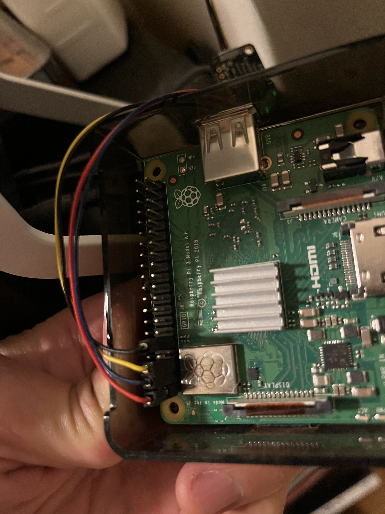

# readme
:toc:
:toclevels: 5

## Summary
. Install bme280 sensor stuff on whichever pis the humidity sensors are hooked up to
. Install pmsa003i sensor stuff on whichever pis the air quality sensors are hooked up to
. Install city data measurer on study.local - this measures local city data, e.g. local air quality
. Setup and install electricity usage measurer on study.local. See below for more details.

## dsh to install or update air quality & temp + humidity sensors on multiple pis:
....
dsh --remoteshell ssh --remoteshellopt '-o UserKnownHostsFile=/dev/null' --remoteshellopt '-o StrictHostKeyChecking=no' --remoteshellopt '-o LogLevel=ERROR' --concurrent-shell --show-machine-names --machine pi@bedroom.local,pi@kitchen.local 'cd /home/pi/development/pitools && git pull && /home/pi/development/pitools/sensors/install_bme280_temp_humidity_sensor && /home/pi/development/pitools/sensors/install_pmsa003i_air_quality_sensor' && dsh --remoteshell ssh --remoteshellopt '-o UserKnownHostsFile=/dev/null' --remoteshellopt '-o StrictHostKeyChecking=no' --remoteshellopt '-o LogLevel=ERROR' --concurrent-shell --show-machine-names --machine pi@bedroom.local,pi@kitchen.local "sudo systemctl status 'measure_*'"
....

## Electricity usage: setup
This data collector integrates with Con Ed to get your account's realtime electricity usage from their API.

From the repo's root directory:

1. `cp https://github.com/dasl-/pitools/blob/main/readme.md[sample_config.json] config.json`
1. Open `config.json` and write the values for `electricity_credentials.email`, `electricity_credentials.password`, and `electricity_credentials.totp_secret`.
1. `/home/pi/development/pitools/sensors/install_electricity_usage_measurer`

### Getting the TOTP secret
See home-assistant's Con Ed integration docs, which I was heavily influenced by: https://www.home-assistant.io/integrations/opower/#consolidated-edison-coned

> The TOTP secret is not one of the 6 digit time-based numeric codes. It is a string of around 16 characters containing the shared secret that enables your authenticator app to generate the correct time-based code at the appropriate time. The QR codes used for setting up TOTP accounts contain the secret. Using the TOTP secret, the Opower integration will be able to generate the correct time-based code when it needs to authenticate to the ConEd website.

In your Con Ed account profile page, you must set your 2-Step Verification mode to Google Authenticator. Con Ed only allows you to do this if you have a phone number associated with your account. After entering a phone number, you may have to wait several hours before Con Ed lets you 2-Step Verification mode to Google Authenticator. Furthermore, the website may give an error mentioning that something went wrong and you have to call Con Ed when trying to setup Google Authenticator. If that happens, try doing it again in a different browser or in an incognito window.

## AQI calculations
Prometheus query to convert pm2.5 to AQI:
....
((50 - 0) / (12 - 0) * ((avg_over_time(ambient_pm25_env{instance=~"$room"}[$aqi_interval]) <= 12) - 0) + 0) or
((100 - 51) / (35.4 - 12.1) * ((avg_over_time(ambient_pm25_env{instance=~"$room"}[$aqi_interval]) <= 35.4) - 12.1) + 51) or
((150 - 101) / (55.4 - 35.5) * ((avg_over_time(ambient_pm25_env{instance=~"$room"}[$aqi_interval]) <= 55.4) - 35.5) + 101) or
((200 - 151) / (150.4 - 55.5) * ((avg_over_time(ambient_pm25_env{instance=~"$room"}[$aqi_interval]) <= 150.4) - 55.5) + 151) or
((300 - 201) / (250.4 - 150.5) * ((avg_over_time(ambient_pm25_env{instance=~"$room"}[$aqi_interval]) <= 250.4) - 150.5) + 201) or
((400 - 301) / (350.4 - 250.5) * ((avg_over_time(ambient_pm25_env{instance=~"$room"}[$aqi_interval]) <= 350.4) - 250.5) + 301) or
((500 - 401) / (500.4 - 350.5) * ((avg_over_time(ambient_pm25_env{instance=~"$room"}[$aqi_interval]) <= 500.4) - 350.5) + 401) or
clamp_max(avg_over_time(ambient_pm25_env{instance=~"$room"}[$aqi_interval]), 600)
....

It's based off of this formula:
....
((I_h - I_l) / (C_h - C_l) * ((avg_over_time(ambient_pm25_env{instance=~"$room.*"}[$aqi_interval]) > C_l and avg_over_time(ambient_pm25_env{instance=~"$room.*"}[$aqi_interval]) <= C_h) - C_l) + I_l) or
....

If prometheus supported using variables in promql, we could probably https://groups.google.com/g/prometheus-users/c/I_XCMS3_BQw/m/l6AbzKxAJAAJ[optimize the query]. Currently it's slightly slow when using a 24h `$aqi_interval`, which is required for calculating the AQI.

See

1. https://en.wikipedia.org/wiki/Air_quality_index#Computing_the_AQI
1. https://www.airnow.gov/sites/default/files/2020-05/aqi-technical-assistance-document-sept2018.pdf

## Sensor wiring

image::img/sensor_wiring2.jpg[wiring,300]

## Issues we've seen before

### Invalid sensor data

Sometimes the sensors stop working. This can be detected if you see anomalous sensor output in graphs. The temperature / humidity data may be constant over time, simply returning the last value it saw before it stopped working. And the air quality sensor may report very high particulate matter readings (the maximum value).

The systemd units may be in a failed state. Checking logs, you may see stuff https://gist.github.com/dasl-/3a00792fd658a122e8da48584099d538[like this]. It's possible that either sensor could fail while the other is still working.

To fix, shutdown the pi and make sure all cables are snuggly connected. There may be a loose connection. Reboot the pi, and hopefully all will be fixed.
