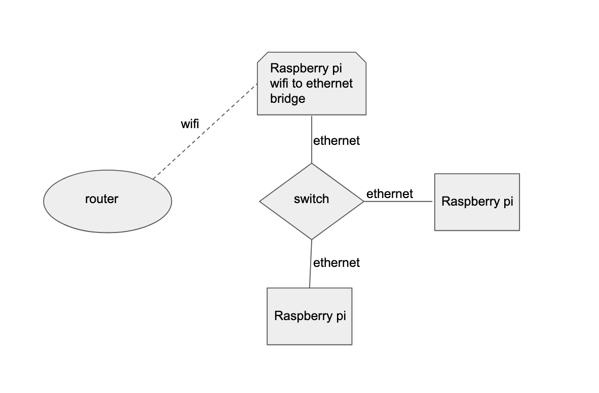

# wifi to ethernet bridge
Credit for this script: https://willhaley.com/blog/raspberry-pi-wifi-ethernet-bridge/

Here is my setup:

I ran speed tests to see how this setup performs:

* wifi pi: a pi connected directly to the router via wifi
    * `router -(wifi)-> pi`
* bridged wifi pi: a pi connected to the bridge
    * `router -(wifi)-> bridge -(ethernet)-> switch -(ethernet)-> pi`

Results:
* median ping was 2.4% higher on the bridged pi.
* median download speed was 3.6% slower on the bridged pi
* median upload speed was 0.1% slower on the bridged pi

Full results: https://docs.google.com/spreadsheets/d/1-WUZSzvB3wJ5-m9yriUo3j6dz_ukoy15ta80-tGRKEw/edit#gid=0

The slowdown from the bridge is negligible.
